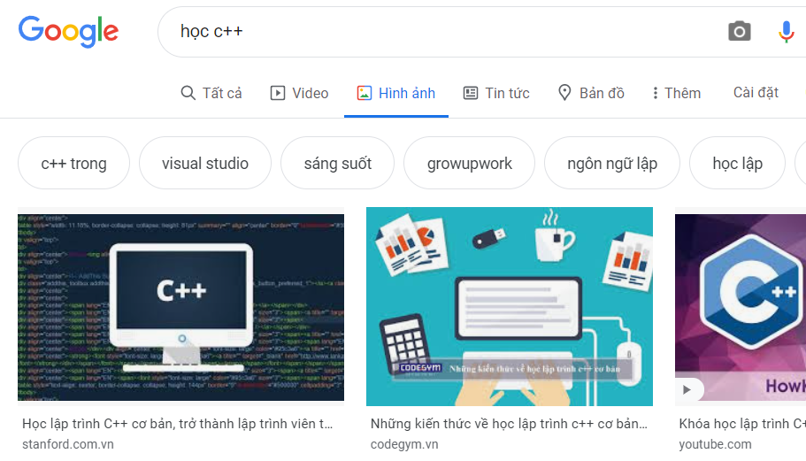

# QT-SEARCH01

## Nhóm N017:
* 16520979 - Huỳnh Anh Quân
---
Hãy cho biết cách sử dụng Google và các site khác để tìm kiếm thông tin sao cho hiệu quả?
## Sử dụng tab tìm kiếm thông minh
Truy cập các tab trên thanh tìm kiếm để truy cập đến các kết quả cụ thể hơn.

## Sử dụng dấu ngoặc kép (" ")
Sử dụng dấu ngoặc kép trong trường hợp muốn hiển thị các kết quả chính xác với nội dụng tìm kiếm.
Ví dụ: "lũ lụt miền trung"
## Sử dụng dấu gạch nối (-)
Sử dụng dấu gạch nối trong trường hợp muốn loại bỏ bớt các kết quả có liên quan
Ví dụ: "lũ lụt -miền -trung"
## Sử dụng dấu hai chấm (:)
Sử dụng dấu hai chấm trong trường hợp cần tìm thông tin cụ thể ở một trang web
Ví dụ: "lũ lụt miền trung site:vnexpress.net"
## Sử dụng dấu sao (* )
Sử dụng dấu sao để tự động làm đầy thông tin cần tìm kiếm
Ví dụ: "lũ * miền trung"
## Tìm trang web tương tự
Sử dụng để tìm các trang web có nội dung tương tự với trang web tìm kiếm
Ví dụ: "related:vnexpress.net"
